# Makas — Database Architecture

Source of truth: [`prisma/schema.prisma`](../prisma/schema.prisma).
Postgres on Neon. **All money columns are integers in kuruş (TRY minor units)** unless explicitly noted.
Multi-tenant by `Shop`. SUPER_ADMIN users have `shopId = null`.

---

## 0. Entity-Relationship Diagram

Rendered automatically on GitHub. Each box lists the most useful columns; full schema is in §2.

```mermaid
erDiagram
    Shop ||--o{ User                 : "users"
    Shop ||--o{ Barber               : "barbers"
    Shop ||--o{ Service              : "services"
    Shop ||--o{ Client               : "clients"
    Shop ||--o{ Appointment          : "appointments"
    Shop ||--o{ Holiday              : "holidays"
    Shop ||--o{ Invoice              : "invoices (Restrict)"
    Shop ||--o{ AuditLog             : "audit (Restrict)"
    Shop ||--o| NotificationSettings : "1:1 settings"
    Shop ||--o{ NotificationJob      : "queue"
    Shop ||--o{ ReviewRequest        : "dispatch"
    Shop ||--o{ Review               : "submitted reviews"
    Shop ||--o{ AnalyticsEvent       : "funnel"

    Barber ||--o| WorkingHours       : "1:1 hours"
    Barber ||--o{ BarberBreak        : "breaks"
    Barber ||--o{ Holiday            : "barber-scoped"
    Barber }o--o{ Service            : "BarberService pivot"
    Barber ||--o{ Appointment        : "schedule"
    Barber ||--o{ ReviewRequest      : "dispatch tracker"
    Barber ||--o{ Review             : "graded by customer"
    Barber ||--o| User               : "1:1 login"

    Client ||--o{ Appointment        : "history"
    Client ||--o{ Review             : "submitted (SetNull)"
    Client ||--o| User               : "0..1 CUSTOMER account"

    Service ||--o{ Appointment       : "booked"

    Appointment ||--o| ReviewRequest : "1:1 on COMPLETED"
    Appointment ||--o| Review        : "1:1 once submitted"
    Appointment ||--o{ NotificationJob : "scheduled SMS/WA"
    Appointment ||--o{ Notification    : "legacy"
    Appointment ||--o{ AuditLog        : "status changes"

    Shop {
        string  id PK
        string  slug UK
        string  customDomain UK "nullable"
        string  status        "ACTIVE|SUSPENDED"
        string  planTier      "STARTER|PRO|ENTERPRISE"
        string  subscriptionStatus "TRIAL|ACTIVE|PAST_DUE|SUSPENDED|CANCELLED"
        string  timezone      "Europe/Istanbul"
        int     defaultCommissionRate
        bool    autoConfirmBookings
        datetime trialEndsAt
        datetime currentPeriodEndsAt
        datetime deletedAt    "soft delete"
        float    avgRating    "aggregate cache; recomputed per Review insert"
        int      totalReviews "aggregate cache"
        bool     reviewReminderEnabled "per-shop opt-out for 2h review SMS/WA"
        string   googleReviewUrl       "direct Google review link; shown after 4★+ internal review"
    }
    User {
        string id PK
        string email UK
        string username UK
        string role         "SUPER_ADMIN|ADMIN|BARBER|RECEPTIONIST|CUSTOMER"
        int    tokenVersion "bump = logout-everywhere"
        string shopId FK
        string barberId FK "nullable, unique"
        string clientId FK "nullable, unique"
    }
    Barber {
        string id PK
        string shopId FK
        string slug "unique per shop"
        string nameTr
        string paymentType  "PERCENTAGE|FIXED"
        int    commissionRate
        int    fixedSalary
        bool   available
        float  rating
    }
    Service {
        string id PK
        string shopId FK
        string nameTr
        int    duration
        int    price "nullable = Sorulur"
        string category "CUTS|BEARD|COMBO|PREMIUM"
        bool   active
    }
    Client {
        string id PK
        string shopId FK
        string name
        string phone "unique per shop; wi-XXX for walk-ins"
        int    totalSpent
        int    visitCount
        int    noShowCount
        bool   blocked
        datetime lastVisitAt
    }
    Appointment {
        string id PK
        string shopId FK
        string clientId FK
        string barberId FK
        string serviceId FK
        string date    "YYYY-MM-DD"
        string time    "HH:MM"
        int    duration
        int    price
        int    grossAmount
        int    barberAmount
        int    shopAmount
        int    tipAmount
        string status  "PENDING|CONFIRMED|IN_PROGRESS|COMPLETED|CANCELLED|NOSHOW"
        string source  "ONLINE|WALK_IN|MANUAL"
        bool   isWalkIn
        string customServiceName
        datetime completedAt
        datetime cancelledAt
    }
    WorkingHours {
        string id PK
        string barberId FK,UK
        int    monStart "minutes from midnight"
        int    monEnd
        int    tueStart
        int    tueEnd
    }
    BarberBreak {
        string id PK
        string barberId FK
        string start "HH:MM"
        string end   "HH:MM"
        int    dayOfWeek "0-6, null=any"
        string date "YYYY-MM-DD, null=recurring"
    }
    Holiday {
        string id PK
        string shopId FK
        string barberId FK "null = shop-wide"
        string date "YYYY-MM-DD"
        string label
    }
    BarberService {
        string barberId  FK,PK
        string serviceId FK,PK
    }
    Invoice {
        string id PK
        string shopId FK "Restrict"
        string providerInvoiceId UK
        string provider "iyzico|stripe|manual"
        int    amount "kurus"
        string currency
        string status "paid|failed|pending|refunded"
        datetime paidAt
        datetime periodEnd
    }
    AuditLog {
        string id PK
        string shopId FK "Restrict, nullable for platform"
        string entity   "appointment|barber|..."
        string entityId
        string action   "status_change|create|delete|reschedule|walkin_price_mismatch"
        string userId
        string appointmentId FK
        json   before
        json   after
    }
    NotificationSettings {
        string id PK
        string shopId FK,UK
        bool   smsEnabled
        bool   waEnabled
        string netgsmUser
        string netgsmPassword "plaintext (risk 1.7)"
        string netgsmHeader
        bool   reminder48h
        bool   reminder3h
        bool   followupEnabled
        int    followupHours
    }
    NotificationJob {
        string id PK
        string shopId FK
        string appointmentId FK
        string channel "SMS|WHATSAPP|IN_APP|PUSH"
        string event   "CREATED|CONFIRMED|CANCELLED|REMINDER_48H|REMINDER_3H|FOLLOWUP"
        string phone   "nullable; required for SMS/WHATSAPP only"
        text   message
        datetime scheduledFor
        string status "PENDING|PROCESSING|SENT|FAILED|CANCELLED"
        int    attempts
        int    maxAttempts
    }
    Notification {
        string id PK
        string shopId FK
        string clientId FK
        string appointmentId FK
        string type
        string channel
        string status
        datetime sentAt
    }
    ReviewRequest {
        string id PK
        string shopId FK
        string appointmentId FK,UK
        string barberId FK
        string token UK
        string customerName
        string customerPhone
        string status "PENDING|SENT|REVIEWED|SKIPPED"
        int    rating
        text   comment
        datetime sentAt
        datetime reviewedAt
    }
    Review {
        string id PK
        string shopId FK
        string appointmentId FK,UK
        string barberId FK
        string customerId FK "nullable; SetNull"
        int    shopRating   "1-5"
        int    barberRating "1-5"
        text   comment
        datetime createdAt
    }
    AnalyticsEvent {
        string id PK
        string shopId FK
        string eventType
        json   metadata
        datetime createdAt
    }
    Lead {
        string id PK
        string businessName
        string name
        string phone
        string email
        text   message
    }
    ProcessedWebhookEvent {
        string provider PK
        string eventId  PK
        datetime processedAt
    }
```



> **Renderer note:** GitHub, GitLab, VS Code (with Markdown Preview Mermaid Support), and most modern viewers render Mermaid natively. If you see raw text instead of a diagram, install a Mermaid plugin or paste into [mermaid.live](https://mermaid.live).

---

## 1. Tenant Hierarchy

```
Shop  (id, slug, customDomain?, status, planTier, subscriptionStatus, deletedAt?)
 │
 ├── User           (role ∈ ADMIN | BARBER | RECEPTIONIST | CUSTOMER)
 │                  · SUPER_ADMIN sits outside this tree (shopId null)
 │
 ├── Barber ─┬── WorkingHours      (1:1, minutes-from-midnight)
 │           ├── BarberBreak       (1:N, recurring or one-off)
 │           ├── Holiday           (1:N, barber-scoped; shop-wide when barberId null)
 │           └── BarberService     (M:N pivot → Service)
 │
 ├── Service       (catalog; price nullable for "Sorulur")
 │
 ├── Client        (unique on (shopId, phone); walk-ins use `wi-…` placeholder)
 │
 ├── Appointment ─┬── Notification      (legacy table)
 │                ├── NotificationJob   (queued SMS/WhatsApp)
 │                ├── ReviewRequest     (1:1; created on COMPLETED — dispatch lifecycle)
 │                ├── Review            (1:1 once customer submits — actual content)
 │                └── AuditLog          (status changes, reschedules, deletes)
 │
 ├── Holiday              (shop-wide; barberId null)
 ├── Invoice              (append-only billing ledger — onDelete: Restrict)
 ├── NotificationSettings (1:1 shop settings + Netgsm creds + templates)
 └── AnalyticsEvent       (conversion-funnel telemetry)
```

**Cross-cutting models with no `Shop` FK:**

- `Lead` — prospective SaaS customers from the marketing landing form.
- `ProcessedWebhookEvent` — idempotency PK on `(provider, eventId)`.

**Restrict-on-delete invariant:** `Shop` cannot be hard-deleted while `Invoice` or platform-level `AuditLog` rows exist. Use `Shop.deletedAt` for soft delete instead (see §6).

---

## 2. Models

### 2.1 `Shop`

Single tenant. Every business entity is scoped to one `Shop`; row-level isolation is enforced in the API layer (always filter by `shopId`).

| Field | Type | Null | Default | Notes |
|---|---|---|---|---|
| `id` | String (cuid) | no | cuid | PK |
| `slug` | String | no | — | `@unique`; URL identifier for tenant routing |
| `customDomain` | String | yes | — | `@unique`; e.g. `mehmetberber.com`, set by super admin after DNS wiring |
| `name` | String | no | — | |
| `logo`, `coverImage` | String | yes | — | Cloudinary URLs |
| `address` / `addressLine` / `city` | String | yes | — | `address` is full text; `addressLine` + `city` are structured |
| `latitude`, `longitude` | Float | yes | — | for map embed |
| `phone`, `whatsappNumber`, `email` | String | yes | — | `whatsappNumber` E.164 (powers wa.me link) |
| `description`, `about` | Text | yes | — | `about` capped at 500 chars in UI |
| `ownerName`, `foundedYear`, `shopType` | mixed | yes | — | `shopType` ∈ `male` \| `female` \| `unisex` |
| `instagramUrl` / `facebookUrl` / `tiktokUrl` | String | yes | — | new per-field validated columns |
| `gallery` | String[] | no | `[]` | ordered Cloudinary URLs, max 12 |
| `social` | Json | yes | — | **legacy** `{ instagram, facebook, tiktok, twitter, website }` — write to both for now |
| `googlePlaceId`, `googlePlacesKey` | String | yes | — | per-shop overrides for reviews widget |
| `googleReviewUrl` | String | yes | — | direct Google "yorum yaz" link. Shown after 4★+ internal reviews. Hostname must be `*.google.com`. |
| `reviewReminderEnabled` | Boolean | no | `true` | per-shop opt-out for the 2h post-completion review reminder cron |
| `mapsEmbed` | Text | yes | — | custom Google Maps embed URL |
| `status` | `ShopStatus` | no | `ACTIVE` | `SUSPENDED` blocks public bookings + admin logins |
| `timezone` | String | no | `Europe/Istanbul` | |
| `currency` | String | no | `TRY` | |
| `defaultCommissionRate` | Int | no | `50` | **percentage 0-100**, not money. Fallback for new barbers |
| `autoConfirmBookings` | Boolean | no | `true` | when false, public bookings land as `PENDING` |
| `planTier` | `PlanTier` | no | `STARTER` | |
| `subscriptionStatus` | `SubscriptionStatus` | no | `TRIAL` | |
| `trialEndsAt`, `currentPeriodEndsAt` | DateTime | yes | — | |
| `paymentProvider` | String | yes | — | `iyzico` \| `stripe` |
| `paymentProviderRef` | String | yes | — | provider-side customer / subscription id |
| `deletedAt` | DateTime | yes | — | **soft delete**; `resolveShopBySlug` filters `null` |
| `createdAt` / `updatedAt` | DateTime | no | now / @updatedAt | |

**Relations (out):** `users`, `barbers`, `services`, `clients`, `appointments`, `holidays`, `auditLogs`, `notifications`, `notificationSettings` (1:1), `notificationJobs`, `reviewRequests`, `invoices`, `analyticsEvents`.

**Indexes / uniques:** PK; `slug` unique; `customDomain` unique.

**Cascade:** `Shop` is parent. Hard delete cascades to every child **except** `Invoice` and `AuditLog`, both of which are `Restrict` and therefore block hard deletion. Use `deletedAt` instead.

**Risk points:**
- `defaultCommissionRate` is a **percent**, not money — easy mistake when grepping for kuruş.
- `social` JSON is legacy; admin UI must write both `instagramUrl` / `facebookUrl` / `tiktokUrl` and the JSON until callers are migrated.
- Soft delete is opt-in at the query level — any new endpoint that loads shops must filter `deletedAt: null`.

---

### 2.2 `User`

Auth + role record. Role-scoped to one shop unless `SUPER_ADMIN`.

| Field | Type | Null | Default | Notes |
|---|---|---|---|---|
| `id` | String (cuid) | no | cuid | PK |
| `email` | String | no | — | `@unique` |
| `username` | String | yes | — | `@unique`; UI login identifier |
| `displayName` | String | yes | — | |
| `passwordHash` | String | no | — | |
| `role` | `Role` | no | `BARBER` | |
| `tokenVersion` | Int | no | `0` | bump on logout to invalidate JWTs |
| `shopId` | String | yes | — | null only for `SUPER_ADMIN` (app-enforced) |
| `barberId` | String | yes | — | `@unique`; non-null for `BARBER` |
| `clientId` | String | yes | — | `@unique`; non-null for `CUSTOMER` |

**Relations (in):** `Shop?`, `Barber?`, `Client?`.

**Indexes / uniques:** PK; `email` unique; `username` unique; `barberId` unique; `clientId` unique; `@@index([shopId])`.

**Cascade:** `shop` FK uses `onDelete: Cascade` — deleting the shop deletes users. `barber` and `client` FKs default to `Restrict` (no `onDelete`), so a `User` blocks deletion of its `Barber` / `Client`.

**Risk points:**
- `shopId` is nullable in the schema but **required** in app code for non-`SUPER_ADMIN`. Validate at insert time.
- `tokenVersion` is the only logout-everywhere mechanism — JWTs are otherwise stateless.

---

### 2.3 `Barber`

Staff member. Has working hours, breaks, holidays, services, and earns either by `PERCENTAGE` commission or `FIXED` salary.

| Field | Type | Null | Default | Notes |
|---|---|---|---|---|
| `id` | String (cuid) | no | cuid | PK |
| `shopId` | String | no | — | |
| `slug` | String | no | — | unique within shop |
| `nameTr` / `nameEn` / `titleTr` / `titleEn` | String | no | — | bilingual labels |
| `bioTr` / `bioEn` | Text | no | — | |
| `avatar` | String | no | — | |
| `profilePhoto` | String | yes | — | base64 data URL or external URL |
| `color` | String | no | `#CC1A1A` | calendar swatch |
| `rating` | Float | no | `5.0` | rolling average |
| `reviewCount` | Int | no | `0` | |
| `yearsExp` | Int | no | `1` | |
| `available` | Boolean | no | `true` | hides from public booking when false |
| `specialties` | String[] | no | — | |
| `paymentType` | `PaymentType` | no | `PERCENTAGE` | `PERCENTAGE` \| `FIXED` |
| `commissionRate` | Int | no | `50` | **percent 0-100**, only meaningful when `PERCENTAGE` |
| `fixedSalary` | Int | yes | — | **kuruş**, only meaningful when `FIXED`; informational — not auto-deducted from appointment splits |

**Relations:** `shop` (Cascade); `user` (1:1, optional); `appointments`; `workingHours` (1:1); `breaks`; `holidays`; `services` (M:N); `reviewRequests`.

**Indexes / uniques:** PK; `@@unique([shopId, slug])` (slug unique per shop); `@@index([shopId])`.

**Cascade:** `shop` → `Cascade`. Children (`WorkingHours`, `BarberBreak`, `Holiday`, `BarberService`, `ReviewRequest`) all cascade from `Barber`. `User.barberId` is `Restrict` by default → a logged-in barber must be removed before deleting the `Barber` row.

**Risk points:**
- `commissionRate` and `fixedSalary` are different units (percent vs kuruş) on the same row.
- `splitRevenue()` in `app/api/appointments/[id]/status/route.js` reads `paymentType` + `commissionRate`; changing a barber's `paymentType` after live appointments exist will not retroactively recompute past `barberAmount` / `shopAmount`.

---

### 2.4 `WorkingHours`

One row per barber. Day-of-week start/end stored as **minutes from midnight** (e.g. 540 = 09:00).

| Field | Type | Null | Notes |
|---|---|---|---|
| `id` | String (cuid) | no | PK |
| `barberId` | String | no | `@unique` |
| `monStart` … `sunEnd` | Int | yes | both null = closed that day |

**Cascade:** `barber` → `Cascade`.
**Risk:** no validation in schema that `*Start < *End`; enforce in app.

---

### 2.5 `BarberBreak`

Recurring or one-off "Mola" blocks the booking grid respects.

| Field | Type | Null | Default | Notes |
|---|---|---|---|---|
| `id` | String (cuid) | no | cuid | PK |
| `barberId` | String | no | — | |
| `start`, `end` | String | no | — | `"HH:MM"` |
| `label` | String | no | `Mola` | |
| `dayOfWeek` | Int | yes | — | `0..6` (Sun..Sat); null = every day |
| `date` | String | yes | — | `"YYYY-MM-DD"` for one-off (e.g. instant break); null = recurring |

**Indexes:** `@@index([barberId])`, `@@index([date])`.
**Cascade:** `barber` → `Cascade`.
**Risk:** `dayOfWeek` and `date` are alternative flavours — the booking grid must check both null states or one-off breaks will fire forever.

---

### 2.6 `Service`

Bookable catalog item per shop.

| Field | Type | Null | Default | Notes |
|---|---|---|---|---|
| `id` | String (cuid) | no | cuid | PK |
| `shopId` | String | no | — | |
| `nameTr` / `nameEn` / `descTr` / `descEn` | String | no | — | |
| `duration` | Int | no | — | minutes |
| `price` | Int | yes | — | **kuruş**, nullable = "Sorulur" |
| `icon` | String | no | `✂️` | |
| `image` | String | yes | — | |
| `category` | `ServiceCategory` | no | — | `CUTS` \| `BEARD` \| `COMBO` \| `PREMIUM` |
| `popular` | Boolean | no | `false` | |
| `active` | Boolean | no | `true` | |
| `sortOrder` | Int | no | `0` | |

**Relations:** `shop` (Cascade); `appointments` (Restrict via default); `barbers` (M:N).
**Indexes:** PK; `@@index([shopId])`.
**Cascade:** `shop` → `Cascade`. `Appointment.serviceId` has no explicit `onDelete`, so it falls back to Prisma's default `Restrict` — a service in use by an appointment cannot be deleted.
**Risk:** `price` nullable means every aggregation must use `?? 0`; revenue routes do this with `??` (preserves real 0 from free appointments).

---

### 2.7 `BarberService` (M:N pivot)

| Field | Type | Notes |
|---|---|---|
| `barberId` | String | composite PK |
| `serviceId` | String | composite PK |

`@@id([barberId, serviceId])`. Both FKs `Cascade` from their parents.

---

### 2.8 `Client`

Customer record per shop. Stores lifetime spend + visit count for cheap reads.

| Field | Type | Null | Default | Notes |
|---|---|---|---|---|
| `id` | String (cuid) | no | cuid | PK |
| `shopId` | String | no | — | |
| `name` | String | no | — | |
| `phone` | String | no | — | walk-in placeholder format: `wi-{ts}-{rand}` (see §6) |
| `email` | String | yes | — | |
| `notes` | Text | yes | — | |
| `photos` | String[] | no | — | reference photo URLs |
| `noShowCount` | Int | no | `0` | bumped/decremented in tx by status PATCH |
| `blocked` | Boolean | no | `false` | |
| `totalSpent` | Int | no | `0` | **kuruş**; updated in tx on COMPLETED |
| `visitCount` | Int | no | `0` | updated in tx on COMPLETED |
| `lastVisitAt` | DateTime | yes | — | |

**Relations:** `shop` (Cascade); `appointments` (Restrict default); `notifications` (`SetNull`); `user` (1:1, optional).

**Indexes / uniques:** `@@unique([shopId, phone])`, `@@index([shopId, name])`.

**Cascade:** `shop` → `Cascade`. `Appointment.clientId` has no explicit `onDelete` so deleting a `Client` with appointments is blocked.

**Risk points:**
- `(shopId, phone)` is unique → walk-ins **must** use the `wi-…` placeholder for anonymous customers, otherwise a second walk-in fails the unique constraint (see `app/api/appointments/walkin/route.js:133`).
- `totalSpent` / `visitCount` / `noShowCount` are denormalized. The status PATCH route (`app/api/appointments/[id]/status/route.js`) is the only writer; any out-of-band mutation drifts the totals. COMPLETED → CANCELLED refunds (`grossAmount + tipAmount`) decrement them.

---

### 2.9 `Appointment`

The hot table. Carries booking, status, revenue split, walk-in marker, and cancellation audit.

| Field | Type | Null | Default | Notes |
|---|---|---|---|---|
| `id` | String (cuid) | no | cuid | PK |
| `shopId` / `clientId` / `barberId` / `serviceId` | String | no | — | FKs |
| `date` | String | no | — | `"YYYY-MM-DD"` (string-typed for cheap range queries) |
| `time` | String | no | — | `"HH:MM"` |
| `duration` | Int | no | — | minutes (denormalized from Service at booking time) |
| `price` | Int | yes | — | **kuruş**; nullable "Sorulur"; on COMPLETED, replaced by final price |
| `status` | `AppointmentStatus` | no | `PENDING` | |
| `source` | `BookingSource` | no | `ONLINE` | `ONLINE` \| `WALK_IN` \| `MANUAL` |
| `notes` | Text | yes | — | |
| `grossAmount` | Int | yes | — | **kuruş**; final charged price set on COMPLETED |
| `barberAmount` | Int | yes | — | **kuruş**; split per `paymentType` + `commissionRate` |
| `shopAmount` | Int | yes | — | **kuruş**; `grossAmount = barberAmount + shopAmount` |
| `tipAmount` | Int | no | `0` | **kuruş**; 100% to barber, never split |
| `paymentMethod` | `PaymentMethod` | yes | — | `CASH` \| `CARD` \| `TRANSFER` |
| `completedAt` | DateTime | yes | — | set on COMPLETED |
| `cancelledAt` | DateTime | yes | — | |
| `cancellationReason` | Text | yes | — | free text, capped 500 chars in route |
| `cancelledBy` | String | yes | — | `client` \| `shop` \| `barber` |
| `isWalkIn` | Boolean | no | `false` | parallel to `source = WALK_IN` |
| `customServiceName` | String | yes | — | walk-in free-text service label |

**Relations:** `shop` (Cascade); `client`/`barber`/`service` (Restrict default); `notifications` (SetNull); `notificationJobs` (SetNull); `reviewRequest` (1:1, Cascade); `auditLogs` (SetNull).

**Indexes / uniques:**
- `@@unique([barberId, date, time])` — **race-condition guard** against double-booking.
- `@@index([shopId, date])`, `@@index([shopId, status])`, `@@index([barberId, date])`, `@@index([clientId])`, `@@index([date])`, `@@index([date, status])` (revenue reports), `@@index([status])`.

**Cascade:** `shop` → `Cascade`. Children that reference the appointment (`Notification`, `NotificationJob`, `AuditLog`) use `SetNull`; `ReviewRequest` uses `Cascade`.

**Risk points (this is the dangerous one):**
- **Money mutations**: `grossAmount` is the single source of truth post-Phase-2. `price` is the legacy column; both must be kept in sync on COMPLETED (the status route writes both).
- **Race on double-completion**: the COMPLETED branch uses `updateMany({ where: { id, status: { not: "COMPLETED" } } })` to atomically claim the row before incrementing `Client.totalSpent`. Any direct `update` on COMPLETED would stack metrics on double-click.
- **Refund path**: COMPLETED → CANCELLED decrements `Client.totalSpent` by `grossAmount + tipAmount` (falls back to `price` if `grossAmount` null). Must stay in a `$transaction`.
- **Unique `(barberId, date, time)`** prevents two bookings on the same slot but **does not** account for duration overlap — a 60-min appointment at 10:00 does not block a 30-min one at 10:30. Slot validation lives in app code.

---

### 2.10 `Holiday`

Shop- or barber-scoped day off.

| Field | Type | Null | Default | Notes |
|---|---|---|---|---|
| `id` | String (cuid) | no | cuid | PK |
| `shopId` | String | no | — | |
| `barberId` | String | yes | — | null = shop-wide (all barbers) |
| `date` | String | no | — | `"YYYY-MM-DD"` |
| `label` | String | no | `Tatil` | |

**Indexes:** `@@index([shopId, date])`, `@@index([date])`, `@@index([barberId, date])`.
**Cascade:** `shop` → `Cascade`; `barber` → `Cascade`.

---

### 2.11 `AuditLog`

Append-only history of mutations on appointments and other entities.

| Field | Type | Null | Notes |
|---|---|---|---|
| `id` | String (cuid) | no | PK |
| `shopId` | String | yes | null = platform-level (SUPER_ADMIN) |
| `entity` | String | no | `appointment`, `barber`, etc. |
| `entityId` | String | no | |
| `action` | String | no | `status_change` \| `reschedule` \| `delete` \| `create` |
| `before` / `after` | Json | yes | snapshots |
| `userId` | String | yes | null = system / public |
| `appointmentId` | String | yes | denormalized FK for fast appointment lookup |

**Indexes:** `@@index([shopId, createdAt])`, `@@index([entity, entityId])`, `@@index([userId])`, `@@index([createdAt])`.
**Cascade:** `shop` → **`Restrict`** (blocks shop hard delete); `appointment` → `SetNull`.
**Risk:** because of `Restrict`, shops with any AuditLog row require soft delete (`deletedAt`).

---

### 2.12 `Notification` (legacy)

Lighter-weight notification log preceding the `NotificationJob` queue.

| Field | Type | Null | Default | Notes |
|---|---|---|---|---|
| `id` | String (cuid) | no | cuid | PK |
| `shopId` | String | no | — | |
| `clientId` | String | yes | — | SetNull |
| `appointmentId` | String | yes | — | SetNull |
| `type` | String | no | — | `reminder` \| `confirmation` \| `cancellation` \| `reschedule` |
| `channel` | String | no | — | `sms` \| `email` \| `push` (free string, not enum) |
| `body` | Text | yes | — | |
| `sentAt` | DateTime | yes | — | |
| `status` | String | no | `pending` | `pending` \| `sent` \| `failed` |

**Indexes:** `@@index([shopId, status])`, `@@index([clientId])`, `@@index([appointmentId])`, `@@index([status])`.
**Cascade:** `shop` → `Cascade`; `client` & `appointment` → `SetNull`.
**Risk:** `channel` and `status` are free strings rather than enums; the canonical queue is `NotificationJob` going forward.

---

### 2.13 `NotificationSettings`

Per-shop SMS/WhatsApp config + Netgsm credentials + per-event templates.

| Field | Type | Null | Default | Notes |
|---|---|---|---|---|
| `id` | String (cuid) | no | cuid | PK |
| `shopId` | String | no | — | `@unique` (1:1 with Shop) |
| `smsEnabled` / `waEnabled` | Boolean | no | `false` | |
| `netgsmUser` / `netgsmPassword` / `netgsmHeader` | String | yes | — | `netgsmHeader` ≤ 11 chars |
| `reminder48h` / `reminder3h` | Boolean | no | `true` | |
| `followupEnabled` | Boolean | no | `false` | |
| `followupHours` | Int | no | `24` | |
| `tplCreated` / `tplConfirmed` / `tplCancelled` / `tplReminder48h` / `tplReminder3h` / `tplFollowup` | Text | yes | — | templates with placeholders |

**Cascade:** `shop` → `Cascade`.
**Risk:** `netgsmPassword` is stored plaintext in the schema; treat the column as sensitive (don't log, don't return to clients).

---

### 2.14 `NotificationJob`

Queue rows for the SMS/WhatsApp worker.

| Field | Type | Null | Default | Notes |
|---|---|---|---|---|
| `id` | String (cuid) | no | cuid | PK |
| `shopId` | String | no | — | |
| `appointmentId` | String | yes | — | SetNull (kept after appt deletion) |
| `channel` | `NotifChannel` | no | — | `SMS` \| `WHATSAPP` \| `IN_APP` \| `PUSH`. Only SMS + WHATSAPP have delivery workers today — `IN_APP` / `PUSH` reserved for the mobile app. |
| `event` | `NotifEvent` | no | — | `CREATED` \| `CONFIRMED` \| `CANCELLED` \| `REMINDER_48H` \| `REMINDER_3H` \| `FOLLOWUP` |
| `phone` | String | yes | — | snapshot at queue time. Required by the caller for SMS/WHATSAPP; null for IN_APP/PUSH. |
| `message` | Text | no | — | rendered template |
| `scheduledFor` | DateTime | no | — | worker query key |
| `status` | `NotifJobStatus` | no | `PENDING` | `PENDING` \| `PROCESSING` \| `SENT` \| `FAILED` \| `CANCELLED` |
| `attempts` / `maxAttempts` | Int | no | `0` / `3` | |
| `lastError` | Text | yes | — | |
| `processedAt` | DateTime | yes | — | |

**Indexes:** `@@index([status, scheduledFor])` (worker poll), `@@index([shopId, createdAt])`, `@@index([appointmentId])`.
**Cascade:** `shop` → `Cascade`; `appointment` → `SetNull`.
**Risk:** worker must claim rows with a `PENDING → PROCESSING` `updateMany` guarded by `id` + `status` to avoid duplicate sends across workers.

---

### 2.15 `ReviewRequest`

One per completed appointment — tracks the *dispatch lifecycle* of the
review-link SMS/WhatsApp. The customer-submitted content lives in `Review`
(§2.16). Splitting them keeps the dispatch tracker a pure state machine.

| Field | Type | Null | Default | Notes |
|---|---|---|---|---|
| `id` | String (cuid) | no | cuid | PK |
| `shopId` | String | no | — | |
| `appointmentId` | String | no | — | `@unique` (1:1 with Appointment) |
| `barberId` | String | no | — | |
| `token` | String | no | `cuid()` | `@unique`; used in public review link |
| `customerName` / `customerPhone` | String | no | — | snapshot |
| `customerEmail` | String | yes | — | |
| `status` | `ReviewRequestStatus` | no | `PENDING` | `PENDING` \| `SENT` \| `REVIEWED` \| `SKIPPED` |
| `sentAt` / `reviewedAt` | DateTime | yes | — | |
| `rating` | Int | yes | — | 1-5 |
| `comment` | Text | yes | — | |

**Indexes:** `@@index([shopId, status])`, `@@index([barberId])`, `@@index([status, createdAt])`.
**Cascade:** `shop` / `appointment` / `barber` all → `Cascade`. Deleting any of them removes the review row.
**Risk:** `appointmentId` unique means duplicate calls to `createReviewRequest` must swallow the unique-violation cleanly (`status` route fires this fire-and-forget; existing helper should upsert or ignore).

---

### 2.16 `Review`

The customer-submitted rating. One row per appointment (`appointmentId @unique`).
Inserted in the same transaction that flips `Appointment.reviewed = true` and
recomputes `Shop.avgRating` / `totalReviews` + `Barber.rating` / `reviewCount`
via running average.

| Field | Type | Null | Default | Notes |
|---|---|---|---|---|
| `id` | String (cuid) | no | cuid | PK |
| `shopId` | String | no | — | tenant scope |
| `appointmentId` | String | no | — | `@unique` (1:1 with Appointment) |
| `barberId` | String | no | — | denormalized from appointment for index |
| `customerId` | String | yes | — | `SetNull` so deleting a Client preserves the review |
| `shopRating` | Int | no | — | 1–5; salon as a whole |
| `barberRating` | Int | no | — | 1–5; the assigned barber |
| `comment` | Text | yes | — | ≤ 1000 chars (validated server-side) |
| `createdAt` | DateTime | no | now | |

**Indexes:** `@@index([shopId, createdAt])` (storefront feed),
`@@index([barberId, createdAt])` (barber dashboard),
`@@index([shopId, shopRating])` (admin star filter),
`@@index([barberId, barberRating])` (barber filter).
**Cascade:** `shop` / `appointment` / `barber` → `Cascade`; `customer` → `SetNull`.
**Insert gate:** server checks `appt.status === COMPLETED && appt.reviewed === false`
before insert; `appointmentId @unique` is the actual concurrency guard
(P2002 → 409).
**Aggregate refresh:** `Shop.avgRating` and `Barber.rating` are running-average
caches updated in the insert tx; if they ever drift, recompute via
`SELECT shopId, AVG(shopRating), COUNT(*) FROM "Review" GROUP BY shopId`.

---

### 2.17 `Lead`

Marketing landing-page contact form. No `Shop` FK.

| Field | Type | Null | Notes |
|---|---|---|---|
| `id` | String (cuid) | no | PK |
| `businessName` / `name` / `phone` | String | no | |
| `email` | String | yes | |
| `message` | Text | yes | |
| `createdAt` | DateTime | no | |

No indexes, no relations. Read by super-admin lead inbox.

---

### 2.18 `AnalyticsEvent`

Conversion-funnel telemetry. Public ingest; never blocks UX.

| Field | Type | Null | Notes |
|---|---|---|---|
| `id` | String (cuid) | no | PK |
| `shopId` | String | no | scoped to shop |
| `eventType` | String | no | gated by `EVENT_TYPES` allowlist in `lib/analytics.js` |
| `metadata` | Json | yes | small payload (`serviceId`, `barberId`, `source`, …) |
| `createdAt` | DateTime | no | |

**Indexes:** `@@index([shopId, createdAt])`, `@@index([shopId, eventType, createdAt])`.
**Cascade:** `shop` → `Cascade`.
**Risk:** single table; per the schema comment, add a daily rollup once volume crosses ~100k/day/shop.

---

### 2.19 `Invoice`

Append-only billing ledger. Webhook handler inserts; no UPDATE except refunds.

| Field | Type | Null | Default | Notes |
|---|---|---|---|---|
| `id` | String (cuid) | no | cuid | PK |
| `shopId` | String | no | — | |
| `providerInvoiceId` | String | yes | — | `@unique`; null for manual entries |
| `provider` | String | yes | — | `iyzico` \| `stripe` \| `manual` |
| `amount` | Int | no | — | **kuruş** (minor units of `currency`) |
| `currency` | String | no | `TRY` | |
| `status` | String | no | — | `paid` \| `failed` \| `pending` \| `refunded` |
| `paidAt` | DateTime | yes | — | |
| `paymentMethod` | String | yes | — | `card` \| `transfer` \| `manual` |
| `periodStart` / `periodEnd` | DateTime | yes | — | |
| `raw` | Json | yes | — | provider payload snapshot |

**Indexes:** `@@index([shopId, createdAt])`, `@@index([status])`; `providerInvoiceId` unique.
**Cascade:** `shop` → **`Restrict`** (forces soft delete).
**Risk:** treat as immutable except for `refunded` status flips; idempotency on insert relies on `providerInvoiceId` unique (and the webhook idempotency table).

---

### 2.20 `ProcessedWebhookEvent`

Idempotency ledger. One row per `(provider, eventId)`; insert-on-entry, PK conflict means replay → ack 200.

| Field | Type | Null | Notes |
|---|---|---|---|
| `provider` | String | no | composite PK |
| `eventId` | String | no | composite PK |
| `processedAt` | DateTime | no | |

`@@id([provider, eventId])`, `@@index([processedAt])`. No relations.

---

## 3. Enums

| Enum | Values | Used By | Notes |
|---|---|---|---|
| `Role` | `SUPER_ADMIN`, `ADMIN`, `BARBER`, `RECEPTIONIST`, `CUSTOMER` | `User.role` | `SUPER_ADMIN` has `shopId = null` |
| `ShopStatus` | `ACTIVE`, `SUSPENDED` | `Shop.status` | `SUSPENDED` blocks public booking + admin login |
| `PlanTier` | `STARTER`, `PRO`, `ENTERPRISE` | `Shop.planTier` | limits keyed off this in `lib/plans.js` |
| `SubscriptionStatus` | `TRIAL`, `ACTIVE`, `PAST_DUE`, `SUSPENDED`, `CANCELLED` | `Shop.subscriptionStatus` | `SUSPENDED` blocks public booking; admin/staff remain accessible (`lib/subscription.js`) |
| `AppointmentStatus` | `PENDING`, `CONFIRMED`, `IN_PROGRESS`, `COMPLETED`, `CANCELLED`, `NOSHOW` | `Appointment.status` | **transitions enforced** in `TRANSITIONS` map — see below |
| `BookingSource` | `ONLINE`, `WALK_IN`, `MANUAL` | `Appointment.source` | parallel to `isWalkIn` |
| `ServiceCategory` | `CUTS`, `BEARD`, `COMBO`, `PREMIUM` | `Service.category` | |
| `PaymentType` | `PERCENTAGE`, `FIXED` | `Barber.paymentType` | drives `splitRevenue()` in status route |
| `PaymentMethod` | `CASH`, `CARD`, `TRANSFER` | `Appointment.paymentMethod` | set on COMPLETED |
| `NotifChannel` | `SMS`, `WHATSAPP`, `IN_APP`, `PUSH` | `NotificationJob.channel` | `IN_APP` / `PUSH` reserved for mobile app — no delivery worker yet |
| `NotifEvent` | `CREATED`, `CONFIRMED`, `CANCELLED`, `REMINDER_48H`, `REMINDER_3H`, `FOLLOWUP` | `NotificationJob.event` | |
| `NotifJobStatus` | `PENDING`, `PROCESSING`, `SENT`, `FAILED`, `CANCELLED` | `NotificationJob.status` | worker claims `PENDING → PROCESSING` |
| `ReviewRequestStatus` | `PENDING`, `SENT`, `REVIEWED`, `SKIPPED` | `ReviewRequest.status` | |

### AppointmentStatus transitions

Authoritative map: `TRANSITIONS` constant in [`app/api/appointments/[id]/status/route.js`](../app/api/appointments/[id]/status/route.js).

| From → To | PENDING | CONFIRMED | IN_PROGRESS | COMPLETED | CANCELLED | NOSHOW |
|---|---|---|---|---|---|---|
| **PENDING** | — | ✓ | ✓ | ✓ | ✓ | ✓ |
| **CONFIRMED** | ✓ | — | ✓ | ✓ | ✓ | ✓ |
| **IN_PROGRESS** | ✗ | ✓ | — | ✓ | ✓ | ✗ |
| **COMPLETED** | ✗ | ✗ | ✗ | — | ✓ (refund) | ✗ |
| **CANCELLED** | ✓ | ✓ | ✗ | ✗ | — | ✗ |
| **NOSHOW** | ✓ | ✓ | ✗ | ✗ | ✗ | — |

Side effects:
- **→ COMPLETED**: requires `finalPrice` (0 ≤ x ≤ 100000 TL). Writes `grossAmount`, `price`, split (`barberAmount` + `shopAmount`), `tipAmount`, `paymentMethod`, `completedAt`. Atomic claim via `updateMany` to avoid double-increment. Bumps `Client.totalSpent` / `visitCount` / `lastVisitAt`. Fires `createReviewRequest`.
- **COMPLETED → CANCELLED**: refunds `Client.totalSpent` and `visitCount` (uses `grossAmount ?? price`, plus `tipAmount`).
- **→ NOSHOW**: increments `Client.noShowCount`. NOSHOW → PENDING/CONFIRMED decrements it.
- **→ CONFIRMED**: queues `CONFIRMED` notifications.
- **→ CANCELLED**: cancels pending jobs, queues `CANCELLED` notifications.

---

## 4. Money Fields Ledger

All money is **integer kuruş (TRY minor units)** unless flagged. `commissionRate` and `defaultCommissionRate` are **percent (0-100)**, included for completeness because they live next to money.

| Column | Unit | Nullable | Written by | Summed / read by |
|---|---|---|---|---|
| `Appointment.price` | kuruş | yes | booking creation (from `Service.price`), status PATCH on COMPLETED (overwrite with finalPrice) | legacy aggregator in `/api/admin/stats`, `/api/admin/revenue` |
| `Appointment.grossAmount` | kuruş | yes | status PATCH on COMPLETED | `/api/admin/stats` (preferred over `price`) |
| `Appointment.barberAmount` | kuruş | yes | status PATCH on COMPLETED via `splitRevenue` | `/api/admin/stats` (barber paid) |
| `Appointment.shopAmount` | kuruş | yes | status PATCH on COMPLETED via `splitRevenue` | `/api/admin/stats` (shop net) |
| `Appointment.tipAmount` | kuruş | no (default 0) | status PATCH on COMPLETED | refund path on COMPLETED → CANCELLED; **never split with shop** |
| `Service.price` | kuruş | yes (null = "Sorulur") | admin services CRUD | snapshot copied to `Appointment.price` at booking time |
| `Client.totalSpent` | kuruş | no (default 0) | status PATCH on COMPLETED (`increment finalPrice + tipAmount`); refunded on COMPLETED → CANCELLED | client profile, top-spender lists |
| `Barber.fixedSalary` | kuruş | yes | admin barbers CRUD | informational only — **not** auto-deducted by appointment splits |
| `Barber.commissionRate` | **percent 0-100** | no (default 50) | admin barbers CRUD | `splitRevenue()` |
| `Shop.defaultCommissionRate` | **percent 0-100** | no (default 50) | shop settings | fallback when creating a new barber |
| `Invoice.amount` | minor units of `Invoice.currency` (kuruş when `TRY`) | no | billing webhook handler | super-admin billing views |

**Invariants:**
- `grossAmount = barberAmount + shopAmount` (enforced in `splitRevenue`).
- `tipAmount` is always on top; never included in shop revenue.
- For PERCENTAGE: `barberAmount = round(finalPrice * rate / 100)`, `shopAmount = finalPrice - barberAmount`.
- For FIXED: `barberAmount = 0`, `shopAmount = finalPrice` (the fixed salary is paid out-of-band; not deducted per appointment).

---

## 5. Foreign-Key Map

| Child.column | → Parent | onDelete | Nullable |
|---|---|---|---|
| `User.shopId` | `Shop.id` | `Cascade` | yes (null for SUPER_ADMIN) |
| `User.barberId` | `Barber.id` | _default Restrict_ | yes |
| `User.clientId` | `Client.id` | _default Restrict_ | yes |
| `Barber.shopId` | `Shop.id` | `Cascade` | no |
| `WorkingHours.barberId` | `Barber.id` | `Cascade` | no |
| `BarberBreak.barberId` | `Barber.id` | `Cascade` | no |
| `Service.shopId` | `Shop.id` | `Cascade` | no |
| `BarberService.barberId` | `Barber.id` | `Cascade` | no |
| `BarberService.serviceId` | `Service.id` | `Cascade` | no |
| `Client.shopId` | `Shop.id` | `Cascade` | no |
| `Appointment.shopId` | `Shop.id` | `Cascade` | no |
| `Appointment.clientId` | `Client.id` | _default Restrict_ | no |
| `Appointment.barberId` | `Barber.id` | _default Restrict_ | no |
| `Appointment.serviceId` | `Service.id` | _default Restrict_ | no |
| `Holiday.shopId` | `Shop.id` | `Cascade` | no |
| `Holiday.barberId` | `Barber.id` | `Cascade` | yes (null = shop-wide) |
| `AuditLog.shopId` | `Shop.id` | **`Restrict`** | yes (null = platform-level) |
| `AuditLog.appointmentId` | `Appointment.id` | `SetNull` | yes |
| `Notification.shopId` | `Shop.id` | `Cascade` | no |
| `Notification.clientId` | `Client.id` | `SetNull` | yes |
| `Notification.appointmentId` | `Appointment.id` | `SetNull` | yes |
| `NotificationSettings.shopId` | `Shop.id` | `Cascade` | no (1:1) |
| `NotificationJob.shopId` | `Shop.id` | `Cascade` | no |
| `NotificationJob.appointmentId` | `Appointment.id` | `SetNull` | yes |
| `ReviewRequest.shopId` | `Shop.id` | `Cascade` | no |
| `ReviewRequest.appointmentId` | `Appointment.id` | `Cascade` | no (1:1) |
| `ReviewRequest.barberId` | `Barber.id` | `Cascade` | no |
| `Review.shopId` | `Shop.id` | `Cascade` | no |
| `Review.appointmentId` | `Appointment.id` | `Cascade` | no (1:1) |
| `Review.barberId` | `Barber.id` | `Cascade` | no |
| `Review.customerId` | `Client.id` | `SetNull` | yes |
| `Invoice.shopId` | `Shop.id` | **`Restrict`** | no |
| `AnalyticsEvent.shopId` | `Shop.id` | `Cascade` | no |

**Restrict FKs (block parent hard delete):** `AuditLog.shopId`, `Invoice.shopId`, plus the default-Restrict appointment FKs (`Client`, `Barber`, `Service`). This is why `Shop.deletedAt` exists.

---

## 6. Soft Delete + Idempotency

### `Shop.deletedAt`
- Only soft-delete mechanism in the schema. Set to a timestamp to retire; reset to `null` to restore.
- The query helper `resolveShopBySlug` (and any tenant resolver) filters `deletedAt: null`.
- Required because `Invoice.shopId` and platform `AuditLog.shopId` are `Restrict` — a real `DELETE` would fail as soon as any billing or platform-level audit row exists.

### `ProcessedWebhookEvent`
- PK = `(provider, eventId)`. Insert on entry; PK conflict means the event has been seen → reply 200 (ack) without reprocessing.
- The `processedAt` index lets the cleaner trim old rows.

### Walk-in placeholder phone
- `Client.@@unique([shopId, phone])` enforces one client row per phone per shop.
- Anonymous walk-ins (no real phone collected) get `phone = wi-{Date.now()}-{rand6}` so each walk-in gets its own unique key — see `app/api/appointments/walkin/route.js:133`.
- Downstream callers check `phone.startsWith("wi-")` to skip SMS / review-request flows (Netgsm would reject the placeholder).

---

## 7. Analytics Dependencies

### `app/api/admin/stats/route.js` (`GET /api/admin/stats`)
Reads:
- `Appointment` aggregations on `{ status, date, shopId, isWalkIn, barberId, serviceId }` summing `price`, `grossAmount`, `barberAmount`, `shopAmount`.
- `Client.count` filtered by `shopId` and `createdAt`.
- `Barber.findMany` (`rating`, `available`) for `avgRating`.
- `Service.findUnique` (`nameTr`) to hydrate top-service name from `groupBy`.
- `Shop.timezone` to pick the day boundary.

**Legacy + Phase-2 fallback (line 98-103):**
```js
const grossThis = thisMonthRev._sum.grossAmount ?? thisMonthRev._sum.price ?? 0;
const shopThis  = thisMonthRev._sum.shopAmount  ?? grossThis;   // pre-Phase-2 = fully shop
const barberThis = thisMonthRev._sum.barberAmount ?? 0;
```
This aggregator mixes legacy `price` rows with Phase-2 `grossAmount` rows: if `grossAmount` sum is null (only legacy data in range), it falls back to `price`. Same pattern for shop split. **Flag**: this means any rollup or comparison route that wants matching numbers must apply the same `??` fallback rule.

### `app/api/admin/revenue/route.js` (`GET /api/admin/revenue?range=7d|30d&barberId=`)
Reads:
- `Appointment.groupBy({ by: date, where: { shopId, status: COMPLETED, date >= start, barberId? }, _sum: { price } })`.

**Discrepancy with stats route:** revenue route only sums **legacy `price`**, never `grossAmount`. Phase-2 appointments still have `price` set (status PATCH writes both `price = finalPrice` and `grossAmount = finalPrice`), so today the numbers agree — but the route will silently undercount if a future change ever stops writing `price`. Consider migrating to the same `grossAmount ?? price` fallback.

### `app/api/superadmin/analytics/route.js` (`GET /api/superadmin/analytics`)
Reads:
- `AnalyticsEvent.groupBy({ by: eventType, where: createdAt >= -30d })` (totals per event).
- `AnalyticsEvent.groupBy({ by: shopId, … take: 10 })` (top 10 shops by volume).
- `Shop.findMany({ id, name, slug })` to hydrate names.

No money fields; only event counts. `EVENT_TYPES` allowlist from `lib/analytics.js` determines which buckets appear in the response even when count is zero.

---

## 8. Related Files

- Schema — `/Users/sercanfurunci/Desktop/makas/prisma/schema.prisma`
- Migrations — `/Users/sercanfurunci/Desktop/makas/prisma/migrations/`
- Status route + `TRANSITIONS` — `/Users/sercanfurunci/Desktop/makas/app/api/appointments/[id]/status/route.js`
- Walk-in route + `wi-` placeholder — `/Users/sercanfurunci/Desktop/makas/app/api/appointments/walkin/route.js`
- Admin stats — `/Users/sercanfurunci/Desktop/makas/app/api/admin/stats/route.js`
- Admin revenue chart — `/Users/sercanfurunci/Desktop/makas/app/api/admin/revenue/route.js`
- Super-admin analytics — `/Users/sercanfurunci/Desktop/makas/app/api/superadmin/analytics/route.js`
