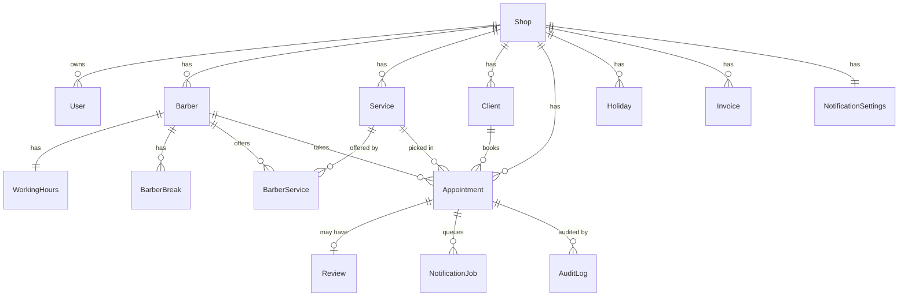
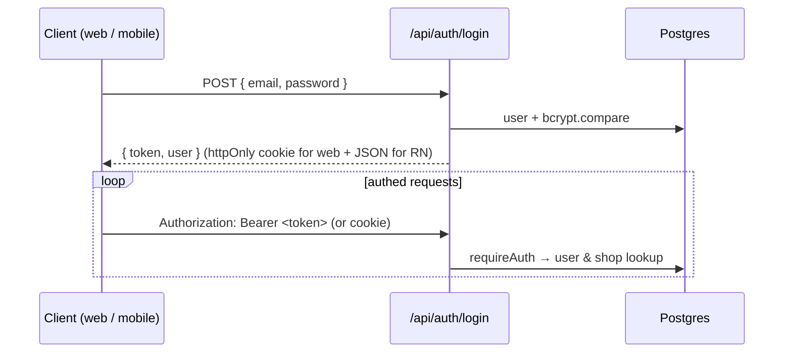
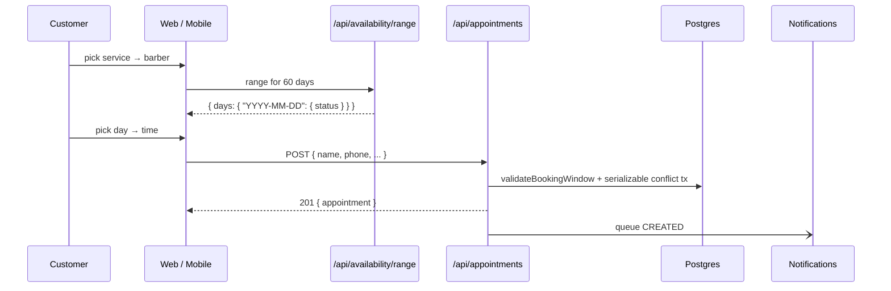

# Project Architecture

Single reference for how Makas is built, what talks to what, and where the seams
sit for future mobile / customer / tablet clients. Complements the deeper
per-system docs already in `docs/` (API_MAP, DATABASE_ARCHITECTURE,
BUSINESS_FLOWS, SYSTEM_RISKS, PROJECT_STRUCTURE, UI_SYSTEM, ROADMAP).

## Overview

Multi-tenant SaaS for Turkish barbershops. Each `Shop` is a tenant; users,
barbers, services, clients and appointments are scoped by `shopId`.
Super-admin sits above tenants for onboarding/support. The API is a Next.js
App Router surface backed by PostgreSQL via Prisma. Payments (iyzico) and SMS
(Netgsm) are behind provider interfaces; images are hosted on Cloudinary.

## Folder structure

```
app/              Next.js routes — pages and /api/* endpoints
components/       React components (booking / admin / superadmin / landing / shared)
contexts/         AuthContext, AppointmentsContext, LanguageContext
lib/              booking, revenue, subscription, notifications, prisma, utils, api
prisma/           schema.prisma, migrations, seeds
scripts/          smoke tests, cron simulators, DB scripts
docs/             this file + per-system docs
```

## Data model (Prisma)



Tenants isolate rows by `shopId`; every write and every read applies that
filter. `User.role ∈ {SUPER_ADMIN, ADMIN, BARBER, RECEPTIONIST}`. Every
JWT-authenticated endpoint funnels through `requireAuth` and applies the
tenant filter (super-admin can override via `shopId` param).

## Authentication

Hybrid cookie + Bearer JWT. `HS256`, 7-day expiry, `tokenVersion` in payload
so bumping the user row invalidates all sessions.



Web reads the cookie automatically. Mobile will read `token` from the login
response and store it in `expo-secure-store`, then send `Authorization: Bearer`.
Both surfaces use the same login endpoint; no separate mobile login route.

## Booking flow



`validateBookingWindow` (`lib/booking.js`) is authoritative: working hours,
holidays, breaks. `POST /api/appointments` layers a serializable transaction
on top for collision safety. Reschedule (`PATCH /api/appointments/[id]`),
walk-in (`POST /api/appointments/walkin`) and admin manual booking all funnel
through the same validator — no bypass paths.

## Availability engine

`/api/availability` — single-day slot list. `/api/availability/range` —
per-day status roll-up (`working | fullyBooked | closed | holiday | past`)
used by the calendar. Shared slot-count core is duplicated between them; a
future extraction would deduplicate.

## Revenue & commissions

`lib/revenue.js` splits `finalPrice` into `barberAmount` and `shopAmount`
based on `Barber.paymentType`:

- `PERCENTAGE` → barber = price × commissionRate/100
- `FIXED` → barber = 0 on the appointment; salary is out-of-band

Split runs at COMPLETE and at WALK-IN. Refund path (COMPLETED → CANCELLED)
decrements `Client.totalSpent` and `Client.visitCount`.

## Subscription

`Shop.subscriptionStatus`, `trialEndsAt`, `plan`. `canAcceptPublicBookings`
gates public POST. `canCreateBarber` gates admin barber POST (returns 402
with `{limit, current}` when hit).

## Reviews

Two sources: (1) internal review flow triggered on COMPLETED
(`createReviewRequest` → token → `/api/review/[token]`); (2) Google Places
proxied through `/api/reviews`. Barber-scoped stats live at
`/api/barber/reviews`, shop-scoped at `/api/admin/reviews`.

## Notifications

`NotificationJob` rows queue outbound messages (SMS/WhatsApp/email/push
templates). `/api/cron/notifications` (secret-token auth) drains the queue.
Providers behind `lib/notifications.js`. Retries + delivery status live on
the row.

## Uploads

Cloudinary via `lib/cloudinary.js`. Namespaces:
- `makas/barbers/{barberId}` — avatar + profile photo
- `makas/shops/{shopId}/gallery/{slot}` — up to 12 gallery images
- `makas/shops/{shopId}/logo`, `.../cover`

Client uploads a data URL to a shop-scoped POST route; server does the
Cloudinary upload and stores the URL. No direct Cloudinary keys leak to
clients. Good for mobile — Expo can upload the same data URL / multipart.

## API architecture

- App Router `route.js` files. One handler per HTTP method.
- Auth via `requireAuth(request)` (cookie or Bearer).
- Prisma singleton in `lib/prisma.js`.
- Responses are direct JSON — no consistent envelope. See
  `docs/API_MAP.md` and the API stabilization section of the mobile-readiness
  audit for the current inconsistencies.

## Deployment

Single Next.js app on Vercel today. `lib/rateLimit.js` uses an in-process
`Map` — correct on single instance, ineffective across Vercel functions.
Upgrade to Upstash Redis before multi-instance production. Prisma pool sized
for serverless (data-proxy / pgbouncer recommended for scale).

## Future — mobile architecture

```
apps/
  web/            (this Next.js app, mostly unmoved)
  mobile/         (Expo — future)
packages/
  api-client/     shared fetch + retry + refresh
  types/          Prisma-derived shared TS types
  validation/     shared zod / regex validators
  utils/          phone normalize, currency, tz helpers
  config/         env parsing, feature flags
  constants/      TR/EN copy, category lists, status enums
```

Mobile hits the same `/api/*` surface. No API split, no separate mobile-only
routes. Auth uses the same JWT — mobile stores the token in
`expo-secure-store` and sends `Authorization: Bearer`. Payments and file
uploads reuse the same endpoints.

## Future — customer application

Consumer app (client-side booking + loyalty). Same DB, same schema, adds
`CustomerAccount` (phone-linked). Bookings created by the customer app run
through `POST /api/appointments` with `source: "APP"` (new source). Reviews
sourced from token + optional in-app login.

## Future — push notifications

Add `PushToken` model (userId or clientId + expoPushToken + platform +
lastSeenAt). `NotificationJob.channel` gains `PUSH`. `lib/notifications.js`
gains a `sendPush` adapter (Expo Push API). Templates already localized;
just add channel routing.

## Future — payment providers

`lib/payments/provider.js` already abstracts iyzico stub. Add stripe /
paytr adapters behind the same interface. Webhook routing keyed on
`Shop.paymentProvider`.

## Future — analytics

Metrics table (`ShopMetric` per day) computed from appointments/reviews
nightly. Removes on-request aggregation in `/api/admin/analytics` and
`/api/admin/stats`. Same query surface, faster response, offline-friendly.
